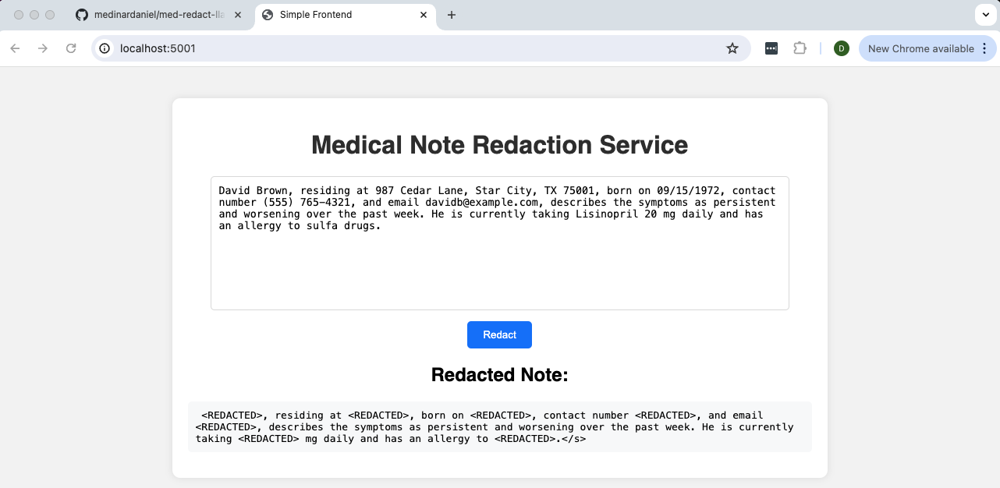
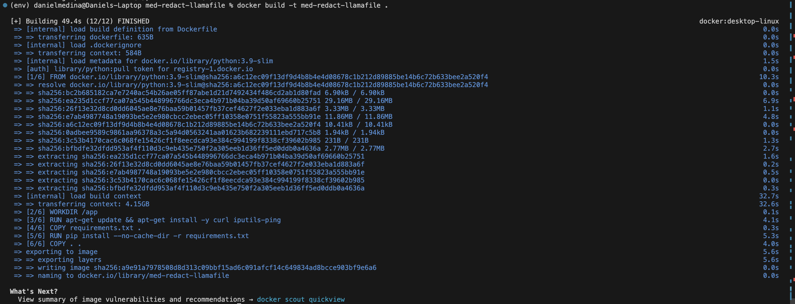
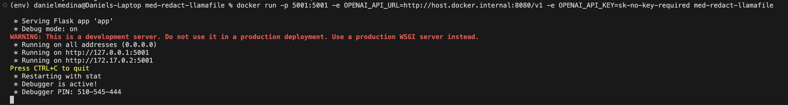

# Medical Note Redaction Service




## Video Demo
[Watch the Final Demo Video](https://youtu.be/UDq5WNwoqXc)

## Project Purpose
The purpose of the Medical Note Redaction Service is to provide a system that redacts PHI (Protected Health Information) from given medical notes. This ensures that sensitive patient information is not exposed when sharing medical documents. The system replaces all PHI information with the word `<REDACTED>`. Running the Docker container and the Llamafile locally allows the user to use the system safely, without sending data that contains PHI to a cloud service.

## Architecture Diagram


### Model Selection
Mistral-7B-Instruct was selected as the language model for this app due to its superior performance in understanding and generating human-like text. This model excels at handling complex instructions and producing accurate, contextually appropriate outputs, which is crucial for redacting sensitive information in medical notes. Additionally, its relatively smaller size compared to other models allows for efficient deployment without sacrificing the quality of text generation, making it an ideal choice for this application.

## Instructions for Setup, Running, and Testing the App

### Setup

1. **Clone the Repository**

   ```bash
   git clone https://github.com/medinardaniel/med-redact-llamafile.git
   cd your-repo

2. **Set Up Virtual Environment**

python3 -m venv env
source env/bin/activate

3. **Install Dependencies**

make install

### Running the App
1. **Download Mistral-7B-Instruct Llamafile**

https://github.com/Mozilla-Ocho/llamafile?tab=readme-ov-file

2. **Build Docker Image**

docker build -t med-redact-llamafile .


3. **Run Docker Container**

docker run -p 5001:5001 -e OPENAI_API_URL=http://host.docker.internal:8080/v1 -e OPENAI_API_KEY=sk-no-key-required med-redact-llamafile



4. **Access the App**

Open your browser and go to http://localhost:5001

### Testing the App

1. **Run Unit Tests**
make test

2. **Example API Call**

curl -X POST http://localhost:5000/redact -H "Content-Type: application/json" -d '{
    "text": "Hi my name is Josephine Smith and I really need my medication shipped to Gotham, NJ 07030. You can also reach me at 123-565-1222 or at jsmith@gmail.com."
}'

**Expected Response**

{
    "redacted_text": "Hi my name is <REDACTED> and I really need my medication shipped to <REDACTED>. You can also reach me at <REDACTED> or at <REDACTED>."
}


## Evaluation

### Evaluation Results

- **Average BLEU score**: 0.890 (89.0%)

- **Median BLEU score**: 0.938 (93.8%)

- **Minimum BLEU score**: 0.618 (61.8%)

- **Maximum BLEU score**: 1.0 (100%)

The high average BLEU score indicates that the predicted notes are highly similar to the true notes, demonstrating the effectiveness of the redaction service in preserving the context and structure of the original medical notes while removing PHI. The median BLEU score, being close to the maximum, further confirms the consistency of the redaction quality across different notes.

The range of BLEU scores from 0.618 to 1.0 highlights that while most notes are accurately redacted, there are some variations that may need further refinement. Overall, these results signify that the Medical Note Redaction Service performs well in its intended task, ensuring the privacy of sensitive patient information.

