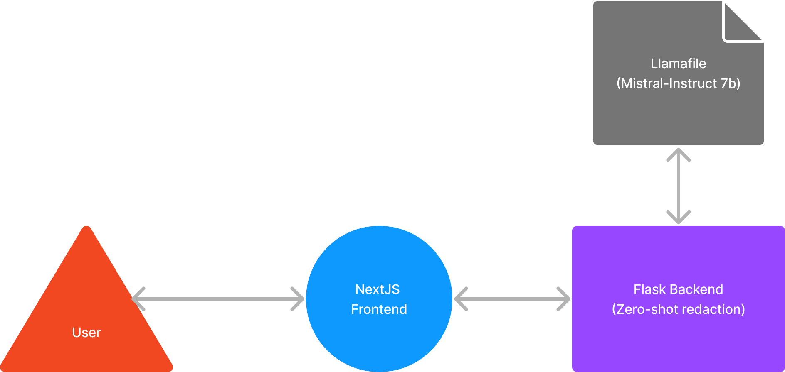

# Medical Note Redaction Service


## Final Demo Video
[Watch the Final Demo Video](https://your-final-demo-video-link.com)

## Project Purpose
The purpose of the Mediacal Note Redaction Service is to provide a system that redacts PHI (Protected Health Information) from given medical notes. This ensures that sensitive patient information is not exposed when sharing medical documents. The system replaces all PHI information with the word `<REDACTED>`.

## Architecture Diagram


## Instructions for Setup, Running, and Testing the App

### Setup

1. **Clone the Repository**
   ```bash
   git clone https://github.com/medinardaniel/med-redact-llamafile.git
   cd your-repo

2. **Set Up Virtual Environment**
python3 -m venv env
source env/bin/activate

3. **Install Dependencies**
make install

### Running the App
1. **Download Mistral-7B-Instruct Llamafile**
https://github.com/Mozilla-Ocho/llamafile?tab=readme-ov-file

2. **Build Docker Image**
docker build -t med-redact-llamafile .

3. **Run Docker Container**
docker run -p 5001:5001 -e OPENAI_API_URL=http://host.docker.internal:8080/v1 -e OPENAI_API_KEY=sk-no-key-required med-redact-llamafile

4. **Access the App**
Open your browser and go to http://localhost:5000

### Testing the App

1. **Run Unit Tests**
make test

2. **Example API Call**
curl -X POST http://localhost:5000/redact -H "Content-Type: application/json" -d '{
    "text": "Hi my name is Josephine Smith and I really need my medication shipped to Gotham, NJ 07030. You can also reach me at 123-565-1222 or at jsmith@gmail.com."
}'

**Expected Response**
{
    "redacted_text": "Hi my name is <REDACTED> and I really need my medication shipped to <REDACTED>. You can also reach me at <REDACTED> or at <REDACTED>."
}
